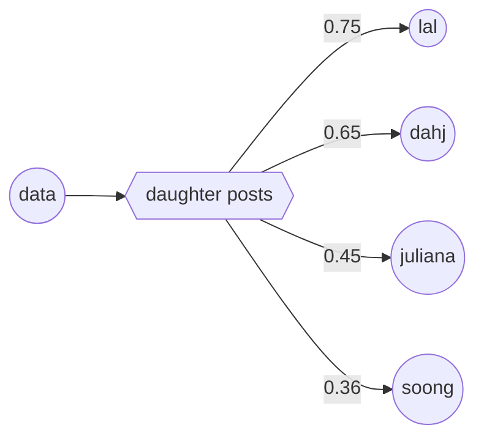
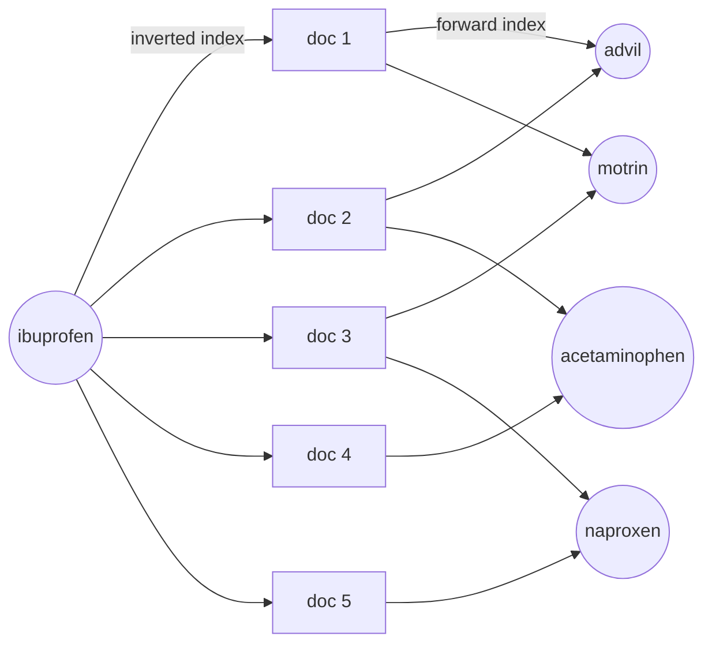
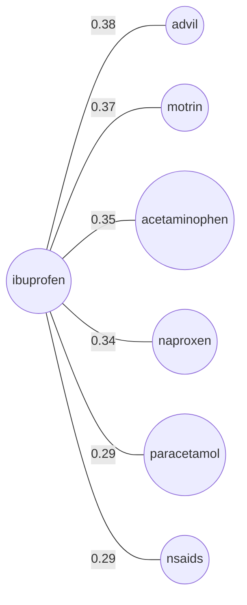

# semantic-knowledge-graph

A proof-of-concept using [Solr](https://solr.apache.org)'s **Semantic Knowledge Graph** (SKG): a graph hiding inside your search index, where terms are nodes and how often they co-occur becomes the weight on the edges between them. Once it's built, you can walk that graph to find and rank semantic relationships between any content in your index — no LLMs, no hand-coded synonym lists, no external knowledge base required.

## Table of Contents

- [See it in action](#see-it-in-action)
- [Prerequisites](#prerequisites)
- [Setup](#setup)
- [Running](#running)
  - [Run the demo examples](#run-the-demo-examples)
- [What each example shows](#what-each-example-shows)
- [How It Works](#how-it-works)
- [The Math Under the Hood](#the-math-under-the-hood)
- [Architecture](#architecture)

---

This repo shows five things you can do with that capability:

1. **Find related terms** — query any term, get back a ranked list of semantically similar terms
2. **Cross-domain** — the same technique works on medical Q&A, sci-fi lore, cooking, travel, or anything else
3. **Query expansion** — turn the SKG output into a boosted query string with five different precision/recall tradeoff strategies
4. **Content-based recommendations** — classify document terms against a category to build a recommendation query
5. **Arbitrary relationships** — compose traversal hops to ask graph-style questions (**_"who is Vader's son?"_**)

---

## See it in action

No LLM, no dictionary, no hand-coded synonyms — just corpus statistics. The fastest way to see it is the interactive CLI: query a term, then keep typing terms to drill down hop by hop through the graph — each hop is a relationship filter on top of the last.

```bash
npm run query
```

```
========================================================================
  SOLR SEMANTIC KNOWLEDGE GRAPH
========================================================================
  Collection: stackexchange
  Enter a term to see what the corpus finds related to it.
  Then enter another term to drill down a hop (relationship filter).
  Commands: "back" (undo last hop), "reset" (start over), "exit".

[stackexchange] Query (or "exit"): vader

Term                 Relatedness
-----------------------------------
  darth                0.89893
  luke                 0.85982
  vader's              0.85408
  anakin               0.82881
  emperor              0.82367
  jedi                 0.81590
  sith                 0.81468
  obi                  0.81406
  wan                  0.80564

[stackexchange] vader > son

Term                 Relatedness
-----------------------------------
  luke                 0.76840
  vader's              0.74034
  emperor              0.72557
  skywalker            0.71956
  darth                0.70199
  anakin               0.69547
  luke's               0.68772
  foreseen             0.58441

[stackexchange] vader > son > luke

Term                 Relatedness
-----------------------------------
  vader's              0.73816
  emperor              0.73112
  skywalker            0.70975
  luke's               0.70437
  anakin               0.66875
  darth                0.65246
  foreseen             0.62714

[stackexchange] vader > son > luke > back

Term                 Relatedness
-----------------------------------
  luke                 0.76840
  vader's              0.74034
  emperor              0.72557
  ...

[stackexchange] vader > son > reset

[stackexchange] Query (or "exit"): exit
```

Two strategic hops and no knowledge graph: ask **_"Who is Vader's son?"_** and the top answer is `luke` — the corpus reconstructs "I am your father" purely from word co-occurrence across StackExchange posts, no screenplay or Wookieepedia required. A third hop (`vader > son > luke`) narrows further to characters and terms tied to Luke's own story. `back` undoes the last hop, `reset` starts over.

Prefer reading over running commands? [Jump straight to the demo output](#run-the-demo-examples) — five annotated examples covering all five capabilities, no setup required.

---

Query **_"kryptonite"_** on a mixed StackExchange corpus and the index discovers other DC Universe terms on its own:

```
Term                 Relatedness
-----------------------------------
  superman             0.81364
  kryptonians          0.74680
  krypton              0.73838
  superman's           0.72344
  kryptonian           0.72173
  metallo              0.67029
  smallville           0.66332
```

Chain two hops together and it can answer relationship questions with zero ontology: **_"Who is Data's daughter?"_** surfaces the two android daughters from two different Star Trek series, decades apart:

```
Related to 'data' via 'daughter':
Term                 Relatedness
-----------------------------------
  lal                  0.75212
  dahj                 0.65383
  juliana              0.45120
  soong                0.36178
  positronic           0.28918
```

Lal is Data's daughter from TNG "The Offspring"; Dahj is his daughter in Picard. These are two of five examples — full output including query expansion and content-based recommendations is in [Run the demo examples](#run-the-demo-examples).

---

## Prerequisites

- **Docker Desktop** — to run Solr (allocate at least 4 GB RAM; multi-collection `relatedness()` faceting is memory-intensive)
- **Node.js 18+** — for native `fetch` and modern `fs` APIs
- **CSV files in `data/`**

### Data layout

```
data/
├── jobs/jobs.csv
├── health/posts.csv
├── cooking/posts.csv
├── scifi/posts.csv
├── travel/posts.csv
└── devops/posts.csv
```

---

## Setup

```bash
git clone <this-repo>
cd <repo-folder>

# Decompress the data files
gunzip data/cooking/posts.csv.gz \
       data/devops/posts.csv.gz \
       data/health/posts.csv.gz \
       data/jobs/jobs.csv.gz \
       data/scifi/posts.csv.gz \
       data/travel/posts.csv.gz

# Start Solr (single node, no ZooKeeper)
docker compose up -d

# Install dependencies
npm install

```

---

## Running

### Index data

```bash
npm run index
```

Creates and populates seven Solr collections: `jobs`, `health`, `cooking`, `scifi`, `travel`, `devops`, and `stackexchange` (the five StackExchange CSVs — health, cooking, scifi, travel, devops — merged automatically during ingest into a single cross-domain collection). Each collection is wiped and rebuilt from scratch on every run. Depending on CSV sizes, expect a few minutes total. Progress is logged per collection:

```
jobs: 30002 documents indexed
health: 12892 documents indexed
...
stackexchange: 389109 documents indexed
```

### Run the demo examples

```bash
npm run demo
```

Runs five labeled examples against the indexed collections and prints results with plain-English commentary explaining each number and decision.

```
========================================================================
Example 1 — Related Terms (health collection)
========================================================================

Query: "ibuprofen" on the health StackExchange collection.

The SKG scans every term that co-occurs with "ibuprofen" posts and asks: does this
term appear *more* in ibuprofen posts than in all posts generally? If yes, it gets
a high relatedness score. Score guide:
  1.0  = perfectly correlated with the query — appears only in these docs
  0.0  = unrelated — appears at the same rate everywhere (like "the", "a")
  < 0  = anti-correlated — less common in these docs than in the collection

Term                 Relatedness
-----------------------------------
  advil                0.38198
  motrin               0.36525
  acetaminophen        0.34762
  naproxen             0.34347
  paracetamol          0.29004
  nsaids               0.28541
  steroidal            0.28378

advil, motrin, acetaminophen, naproxen — the SKG found every OTC pain-relief
synonym and generic/brand pairing purely from word distribution across 12,000+ posts.
No medical dictionary. No hand-coded synonyms.

========================================================================
Example 2 — Domain Switch (stackexchange — sci-fi)
========================================================================

Same technique, completely different domain. Query: "kryptonite" on the combined
StackExchange collection (health + cooking + scifi + travel + devops posts).

The SKG has no idea what kryptonite is. It just notices that certain other words
appear disproportionately often in posts that mention kryptonite. Those happen
to be other DC Universe terms — the corpus "knows" the domain.

Term                 Relatedness
-----------------------------------
  superman             0.81364
  kryptonians          0.74680
  krypton              0.73838
  superman's           0.72344
  kryptonian           0.72173
  metallo              0.67029
  smallville           0.66332

superman, kryptonians, krypton, metallo, smallville — all DC Universe terms,
surfaced without any comic book ontology. The corpus knew the domain; the code didn't.

========================================================================
Example 3 — Query Expansion (stackexchange)
========================================================================
"kryptonite" alone finds 299 posts. The SKG found 7 related terms:

    superman       0.81  (highly correlated with kryptonite posts)
    kryptonians    0.75  (highly correlated with kryptonite posts)
    krypton        0.74  (highly correlated with kryptonite posts)
    superman's     0.72  (highly correlated with kryptonite posts)
    kryptonian     0.72  (highly correlated with kryptonite posts)
    metallo        0.67  (highly correlated with kryptonite posts)
    smallville     0.66  (highly correlated with kryptonite posts)

We can use those terms to cast a wider or narrower net:

  Baseline: search "kryptonite" only
  → 299 posts

  Strategy 1: search for kryptonite OR superman OR krypton OR any related term
  → 2584 posts  (+764%)  Most are Superman posts that never say "kryptonite"

  Strategy 2: post must contain at least 2 of the 8 terms
  → 950 posts   (+218%)  Cuts noise — accidental single-word matches drop out

  Strategy 3: post must contain at least 30% of the 8 terms (≥3 words)
  → 950 posts   (+218%)  Same here — these terms cluster so tightly that matching 2 implies 3+

  Strategy 4: "kryptonite" is required, plus at least one related term
  → 270 posts   (-10%)  Stricter than baseline — some kryptonite posts mention none of the related terms

  Strategy 5: only "kryptonite" posts, but rank by how many related terms they also mention
  → 299 posts   (same)  Same docs as baseline, most conceptually rich ones rise to the top

========================================================================
Example 4 — Content-Based Recommendations (stackexchange)
========================================================================

Instead of a user query, we start from the terms in a document and ask: which
of these terms are semantically relevant to "star wars"? Terms that cluster with
Star Wars in the corpus score high. Terms from other franchises (batman, joker,
gotham) score negative — the SKG discriminates between them. The positive-scoring
terms then drive a recommendation query to fetch similar posts.

Term relatedness to 'star wars':
Term                 Relatedness  Note
-------------------------------------------------------
  luke                 0.75337
  vader                0.71886
  han                  0.70249
  leia                 0.66419
  r2-d2                0.56442
  chewbacca            0.51749
  c-3po                0.50649
  gotham               0.00000  ← wrong franchise
  joker                -0.02292  ← wrong franchise
  batman               -0.02716  ← wrong franchise

The 7 positive-scoring terms become a recommendation query. Top 5 matching posts:

Top 5 recommended documents:
  1. Has R2-D2 ever been inside the Millennium Falcon's cockpit?
  2. Whose arms would Chewbacca have ripped off?
  3. Why is C-3PO kept in the dark in Return of the Jedi while R2-D2 is not?
  4. Why didn't Darth Vader follow the Millennium Falcon?
  5. Did the Alliance and the Empire ever fight a common enemy outside of Shadows of the Empire?

========================================================================
Example 5 — Arbitrary Relationships (scifi collection)
========================================================================

Three-level traversal: "data" → "daughter" → top related terms.

"daughter" is the relationship filter. We're not asking who co-occurs with Data
generally — we're asking: of all posts about Data that also discuss a daughter,
which characters appear disproportionately? The answer should be the specific
characters canonically tied to that relationship, discovered purely from corpus
statistics with no knowledge graph or ontology.

Related to 'data' via 'daughter':
Term                 Relatedness
-----------------------------------
  lal                  0.75212
  dahj                 0.65383
  juliana              0.45120
  soong                0.36178
  positronic           0.28918
  androids             0.18340
  robotics             0.18264

Lal is the android daughter Data builds in TNG "The Offspring." Dahj is his
daughter in Picard. Two characters from two different series, spanning decades
of Star Trek — surfaced by two strategic hops through an inverted index.
```

### Query interactively

```bash
npm run query
```

Prompts for a term, runs it against the `stackexchange` collection, and prints the SKG's related-terms table — a quick way to explore relatedness on your own words without editing `demo.ts`. Enter another term afterward to drill down a hop (a relationship filter on top of the current path, same technique as Example 5's `"data" → "daughter"` traversal). Type `back` to undo the last hop, `reset` to start over, or `exit` to quit. See [See it in action](#see-it-in-action) above for a full multi-hop transcript.

---

## What each example shows

**Example 1 — Related Terms (health):** Queries **_"ibuprofen"_** against the health collection. It instantly surfaces *advil*, *motrin*, *acetaminophen*, and *naproxen* — discovering OTC pain-relief synonyms and generic/brand pairings purely via word distribution.

**Example 2 — Domain Switch (stackexchange):** Runs the exact same code against a multi-domain collection using the query **_"kryptonite"_**. Without any external dictionary, the SKG immediately shifts domains to surface *superman*, *kryptonians*, and *smallville*.

**Example 3 — Query Expansion (stackexchange):** Explores 5 distinct strategies to turn SKG terms into boosted Solr queries. Demonstrates how to balance precision and recall — an OR strategy expands matches by +764%, while a stricter "required + optional boost" strategy targets the highest-quality 270 posts.

**Example 4 — Content-Based Recommendations (stackexchange):** Classifies a mixed bag of pop-culture terms against a **_"star wars"_** foreground. Sci-fi terms score high, while DC comics terms (*gotham*, *batman*) score *negative*, filtering out the noise. Converts the positive terms into a boosted recommendation string to fetch highly relevant documents.

**Example 5 — Arbitrary Relationships (scifi):** Two-hop traversal: `"data" → "daughter" → related terms`. Data is the android character from Star Trek: The Next Generation. By isolating posts where Data and daughter intersect, the index surfaces *Lal* (his daughter in TNG) and *Dahj* (his daughter in Picard) — bridging two TV shows filmed 30 years apart, with no knowledge graph or ontology.



---

## How It Works

Solr builds an **inverted index** — a lookup table mapping every term to the documents it appears in, and how often. Solr's `relatedness()` facet function exploits this index by comparing two distributions:

- **Foreground** — documents matching your query (e.g., posts mentioning "ibuprofen")
- **Background** — all documents in the collection

A term gets a **high relatedness score** when it appears *much more often* in the foreground than in the background. Advil and motrin spike in ibuprofen posts; *the*, *and*, *a*, *of*, *its*, *they*, *with* do not — their frequency is roughly the same in every document regardless of topic, so their foreground and background distributions are nearly identical and their score lands near zero.

No stop-word list required. The engine never needs to be told which words are meaningless; the statistics show it. The result is an automatically discovered concept graph grounded entirely in your corpus — terms that consistently appear in the same contexts surface as semantically related, whether or not a human ever labelled that relationship.

The two index structures do all the work:



The **inverted index** maps the query term to the documents it appears in (the foreground set). The **forward index** (Doc Values) then maps each of those documents back out to all the other terms they contain. Terms that appear across many of those documents — and rarely outside them — score highest.

**Under the hood:** the JSON facet request `skg.ts` sends to Solr looks like this:

```json
{
  "query": "content:ibuprofen",
  "facet": {
    "related_terms": {
      "type": "terms",
      "field": "content",
      "limit": 10,
      "facet": {
        "relatedness": "relatedness(query('content:ibuprofen'), query('*:*'))"
      }
    }
  }
}
```

The inner `relatedness()` call is the key: the first argument is the foreground query, the second (`*:*`) is the background. Solr scores each candidate term by how much its document frequency shifts between the two sets.

The output is a weighted term graph — query any word and get back a ranked neighborhood of semantically related concepts:



---

## The Math Under the Hood

Solr's `relatedness()` calculation is not a naive percentage shift. It scales via a modified statistical significance calculation designed to balance popularity against specificity, bounding the resulting scores between `-1.0` and `+1.0`.

For a given term $T$, a foreground query $F$, and a background corpus $B$, the score evaluates the divergence between the observed probability $P(T|F)$ and the expected baseline probability $P(T|B)$:

$$\text{Relatedness} = f\left( P(T|F), P(T|B) \right)$$

*   **Positive scores (0.0 to 1.0):** The term occurs significantly *more* frequently in the foreground than expected.
*   **Zero score (0.0):** The term mimics general background distribution (e.g., stop words, syntax tokens).
*   **Negative scores (-1.0 to 0.0):** The term is explicitly *anti-correlated* or actively avoided within the foreground context.

---

## Architecture

| File | Role |
|------|------|
| [src/solr-client.ts](src/solr-client.ts) | Thin HTTP wrapper (`solrGet`, `solrPost`, `solrPostForm`) |
| [src/indexer.ts](src/indexer.ts) | Collection lifecycle + CSV ingestion |
| [src/skg.ts](src/skg.ts) | `buildRequest`, `traverse`, `buildExpandedQuery` |
| [src/index.ts](src/index.ts) | `npm run index` entry point |
| [src/demo.ts](src/demo.ts) | `npm run demo` entry point |
| [src/cli.ts](src/cli.ts) | `npm run query` entry point — interactive multi-hop traversal |
